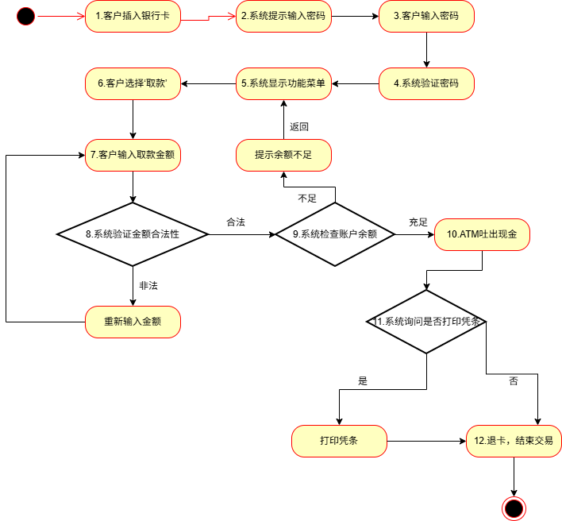

# UML 作业 - ATM 系统

### 一、项目愿景（Vision）
#### 1.1. 项目背景
随着银行业务的不断发展，传统人工柜台办理业务效率较低，无法满足大量客户需求。ATM 自动取款机系统通过自助服务方式，使用户能够独立完成基本银行业务，从而提高效率并降低运营成本。

#### 1.2. 项目目标
本系统旨在实现一个 ATM 自助服务系统，提供基本银行业务功能，包括取款、存款、查询余额、转账等，提高用户体验与业务处理效率。

#### 1.3. 用户描述
- **银行客户**：使用 ATM 完成各类操作
- **银行系统**：提供账户验证与数据支持

#### 1.4. 系统功能概述
系统应支持以下功能：
- 取款
- 存款
- 查询余额
- 转账
- 修改密码
- 打印凭条
- 退卡

#### 1.5. 系统范围
本系统主要实现 ATM 的用户交互及显示模块，不涉及银行后台系统的具体实现。

---

### 二、用例模型（Use-Case Model）

#### 2.1. 参与者
- 客户
- 银行系统

#### 2.2. 用例列表
- 取款
- 存款
- 查询余额
- 转账
- 修改密码
- 打印凭条
- 退卡

#### 2.3. 用例图

![[Drawing 2026-03-31 09.30.11.excalidraw.png]]

#### 2.4. 用例说明

|      |                                                                                                                                                                                                                 |
| :--- | --------------------------------------------------------------------------------------------------------------------------------------------------------------------------------------------------------------- |
| 用例名称 | 取款                                                                                                                                                                                                              |
| 用例编号 | UC001                                                                                                                                                                                                           |
| 用例简述 | 客户通过 ATM 机提取账户中的现金                                                                                                                                                                                              |
| 用例图  |                                                                                                                                                                                                           |
| 主要流程 | <ol><li> 客户插入银行卡 <li> 系统提示输入密码 <li> 客户输入密码 <li> 系统验证密码 <li> 系统显示功能菜单 <li> 客户选择“取款” <li> 客户输入取款金额 <li> 系统验证金额合法性 <li> 系统检查账户余额 <li> ATM 吐出现金 <li> 系统询问是否打印凭条 <li> 退卡，结束交易 </ol> |
| 替代流程 | <ul><li> 3a：密码错误 → 提示重新输入 <li> 3b：密码错误3次 → 吞卡 <li> 8a：金额非法 → 重新输入 <li> 9a：余额不足 → 提示并返回 </ul>                                                                                                           |
| 业务规则 | <ul><li> 取款金额必须为50的倍数 <li> 单次取款上限5000 <li> 手续费按比例计算</ul>                                                                                                                                                  |

---

### 三、补充规约（Supplementary Specification）

#### 3.1. 性能要求
- 系统响应时间不超过2秒
- 交易处理应实时完成

#### 3.2. 安全性
- 密码必须加密传输
- 连续输错3次锁卡
- 所有交易需身份验证

#### 3.3. 可用性
- 操作界面简洁易懂
- 提供明确提示信息
- 支持连续操作

#### 3.4. 可靠性
- 系统应保证交易一致性
- 出现异常时自动回滚

#### 3.5. 约束
- 必须依赖银行后台系统
- 必须使用银行卡操作

---

### 四、术语表（Glossary）

|术语|说明|
|---|---|
|ATM|自动取款机|
|用户|使用ATM的人|
|账户|银行账户|
|交易|一次完整操作|
|凭条|交易打印记录|
|密码|用户身份验证信息|

---

### 五、迭代计划（Iteration Plan）

#### 5.1. 初始阶段（Inception）
- 完成 Vision 文档
- 确定主要用例

#### 5.2. 细化迭代1（Iteration 1）
- 完成取款功能分析
- 绘制用例图
- 编写详细用例

#### 5.3. 细化迭代2（Iteration 2）
- 完成查询余额、修改密码
- 完善用例模型

#### 5.4. 细化迭代3（Iteration 3）
- 完成转账、存款功能
- 完善系统模型

#### 5.5. 时间安排

| 阶段  | 内容      | 时间   |
| --- | ------- | ---- |
| 初始  | Vision  | 第5周  |
| 迭代1 | 取款      | 第9周  |
| 迭代2 | 查询/修改密码 | 第10周 |
| 迭代3 | 完善系统    | 第14周 |
