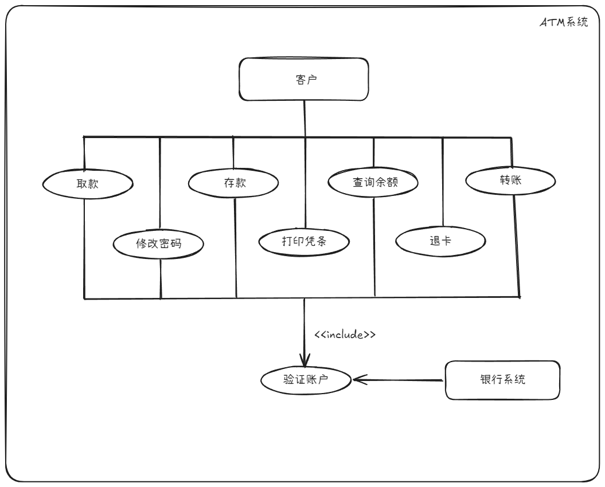
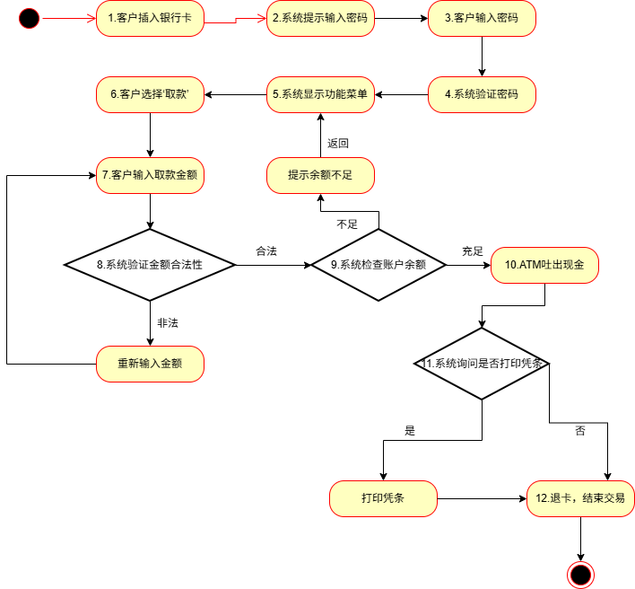
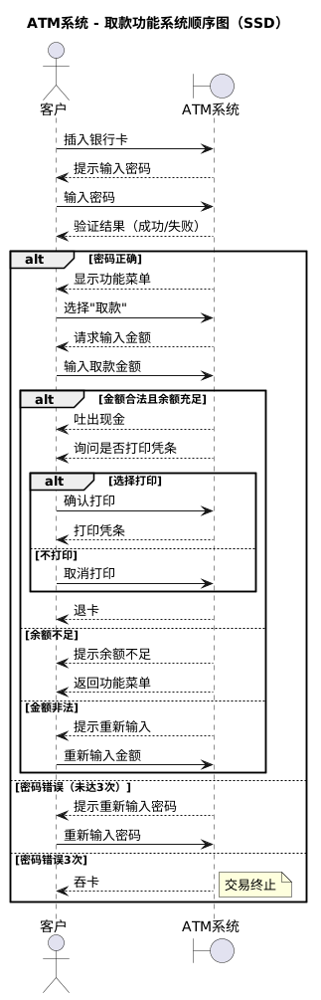
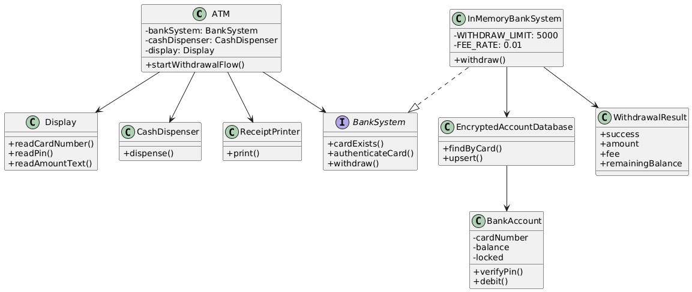
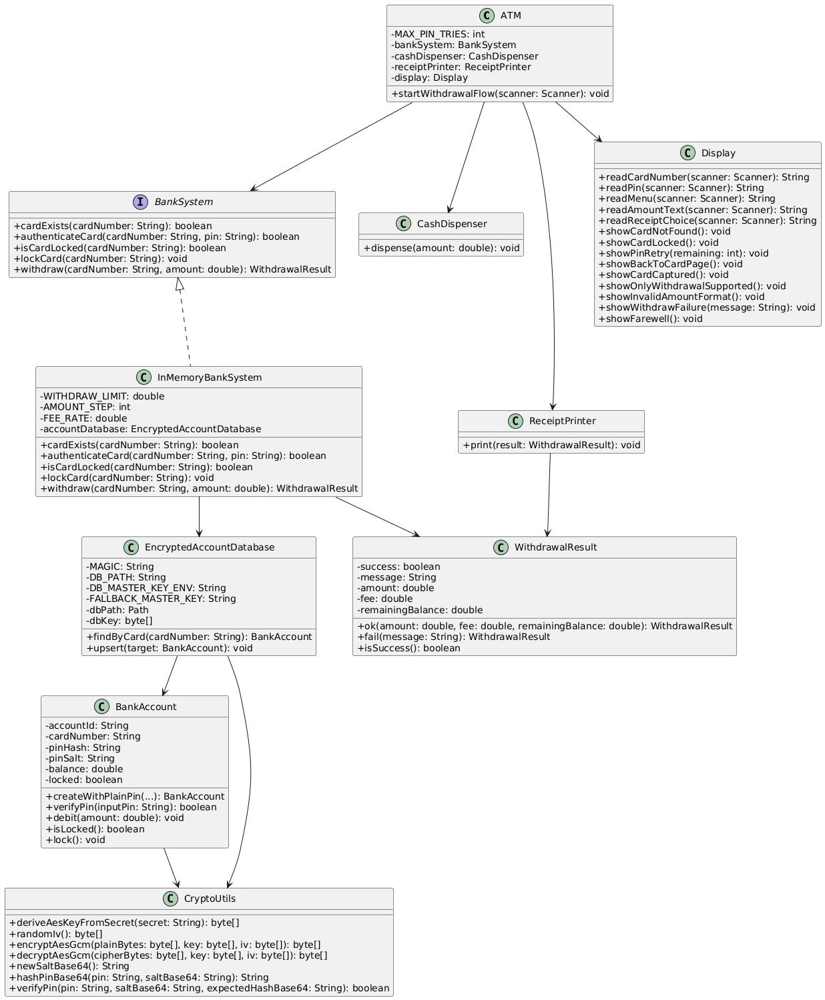
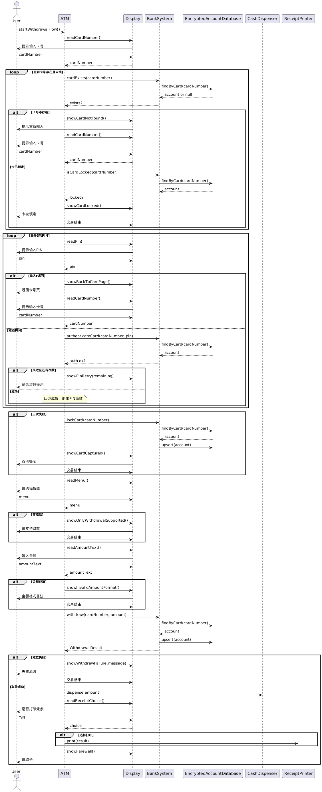
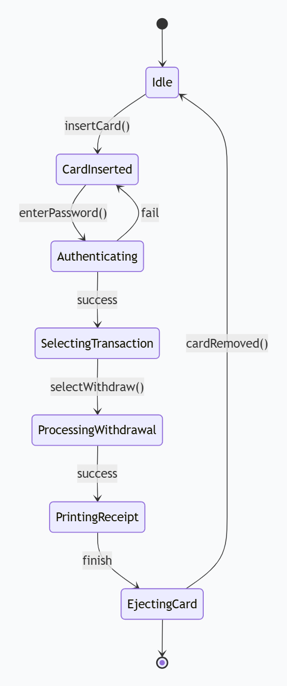

### 一、项目愿景（Vision）
#### 1.1. 项目背景
随着银行业务的不断发展，传统人工柜台办理业务效率较低，无法满足大量客户需求。ATM 自动取款机系统通过自助服务方式，使用户能够独立完成基本银行业务，从而提高效率并降低运营成本。

#### 1.2. 项目目标
本系统旨在实现一个 ATM 自助服务系统，提供基本银行业务功能，包括取款、存款、查询余额、转账等，提高用户体验与业务处理效率。

#### 1.3. 用户描述
- **银行客户**：使用 ATM 完成各类操作
- **银行系统**：提供账户验证与数据支持

#### 1.4. 系统功能概述
系统应支持以下功能：
- 取款
- 存款
- 查询余额
- 转账
- 修改密码
- 打印凭条
- 退卡

#### 1.5. 系统范围
本系统主要实现 ATM 的用户交互及显示模块，不涉及银行后台系统的具体实现。

---

### 二、用例模型（Use-Case Model）

#### 2.1. 参与者
- 客户
- 银行系统

#### 2.2. 用例列表
- 取款
- 存款
- 查询余额
- 转账
- 修改密码
- 打印凭条
- 退卡

#### 2.3. 用例图



#### 2.4. 用例说明

|      |                                                                                                                                                                                                                 |
| :--- | --------------------------------------------------------------------------------------------------------------------------------------------------------------------------------------------------------------- |
| 用例名称 | 取款                                                                                                                                                                                                              |
| 用例编号 | UC001                                                                                                                                                                                                           |
| 用例简述 | 客户通过 ATM 机提取账户中的现金                                                                                                                                                                                              |
| 用例图  |                                                                                                                                                                                                 |
| 主要流程 | <ol><li> 客户插入银行卡<br><li> 系统提示输入密码<br><li> 客户输入密码<br><li> 系统验证密码<br><li> 系统显示功能菜单<br><li> 客户选择“取款”<br><li> 客户输入取款金额<br><li> 系统验证金额合法性<br><li> 系统检查账户余额<br><li> ATM 吐出现金<br><li> 系统询问是否打印凭条<br><li> 退卡，结束交易 </ol> |
| 替代流程 | <ul><li> 3a：密码错误 → 提示重新输入<br><li> 3b：密码错误3次 → 吞卡<br><li> 8a：金额非法 → 重新输入<br><li> 9a：余额不足 → 提示并返回 </ul>                                                                                                           |
| 业务规则 | <ul><li> 取款金额必须为50的倍数<br><li> 单次取款上限5000<br><li> 手续费按比例计算</ul>                                                                                                                                                  |

---

### 三、补充规约（Supplementary Specification）

#### 3.1. 性能要求
- 系统响应时间不超过2秒
- 交易处理应实时完成

#### 3.2. 安全性
- 密码必须加密传输
- 连续输错3次锁卡
- 所有交易需身份验证

#### 3.3. 可用性
- 操作界面简洁易懂
- 提供明确提示信息
- 支持连续操作

#### 3.4. 可靠性
- 系统应保证交易一致性
- 出现异常时自动回滚

#### 3.5. 约束
- 必须依赖银行后台系统
- 必须使用银行卡操作

---

### 四、术语表（Glossary）

|术语|说明|
|---|---|
|ATM|自动取款机|
|用户|使用ATM的人|
|账户|银行账户|
|交易|一次完整操作|
|凭条|交易打印记录|
|密码|用户身份验证信息|

---

### 五、迭代计划（Iteration Plan）

#### 5.1. 初始阶段（Inception）
- 完成 Vision 文档
- 确定主要用例

#### 5.2. 细化迭代1（Iteration 1）
- 完成取款功能分析与实现（认证、金额校验、扣款、吐钞、凭条）
- 绘制取款 SSD（System Sequence Diagram）
- 编写详细用例与替代流程（密码错误、余额不足、金额非法）



#### 5.3. 细化迭代2（Iteration 2）
- 完成查询余额、修改密码
- 完善用例模型

#### 5.4. 细化迭代3（Iteration 3）
- 完成转账、存款功能
- 完善系统模型

#### 5.5. 时间安排

| 阶段  | 内容      | 时间   |
| --- | ------- | ---- |
| 初始  | Vision  | 第5周  |
| 迭代1 | 取款      | 第9周  |
| 迭代2 | 查询/修改密码 | 第10周 |
| 迭代3 | 完善系统    | 第14周 |

---

### 六、细化迭代一（基于代码实现）

#### 6.1 迭代目标
本次细化迭代聚焦“取款”主用例，完成从终端交互到银行业务校验再到账户持久化更新的端到端流程。

#### 6.2 已实现范围
- 身份认证：支持卡号存在性检查、锁卡检查、PIN 校验（最多 3 次）
- 取款交易：支持金额格式校验、业务规则校验、手续费计算与扣款
- 设备交互：支持吐钞、凭条打印选择、交易结束提示
- 数据存储：账户数据以加密文件方式持久化保存

#### 6.3 关键实现与职责分配
- `device.ATM`：交易流程控制器，串联认证、菜单选择、取款与设备动作
- `device.Display`：负责控制台输入输出与用户提示
- `system.BankSystem`：银行业务能力接口（认证、锁卡、取款）
- `system.InMemoryBankSystem`：取款规则与扣款实现
- `system.EncryptedAccountDatabase`：加密账户库读写（`data/accounts.encdb`）
- `model.BankAccount`：账户实体（余额、锁卡状态、PIN 验证）
- `model.WithdrawalResult`：交易结果对象（成功/失败、金额、手续费、余额）

#### 6.4 业务规则（与代码一致）
- 单次取款金额必须大于 0
- 取款金额必须为 50 的倍数
- 单次取款上限为 5000 元
- 手续费按 1% 计算（`fee = amount * 0.01`）
- 可用余额校验基于 `amount + fee`
- 密码连续输错 3 次后锁卡并结束交易

#### 6.5 主成功场景（摘要）
1. 客户输入卡号，系统校验卡号存在且未锁定
2. 客户输入 PIN，系统认证通过
3. 客户选择“1.取款”并输入金额
4. 系统完成金额规则校验与余额校验
5. 系统扣款并更新账户存储
6. 设备吐钞，用户可选择是否打印凭条
7. 系统提示取卡，交易结束

#### 6.6 替代/异常流程
- 卡号不存在：提示重新输入卡号
- 卡已锁定：终止交易并提示联系柜台
- PIN 错误且未达上限：提示剩余次数并重试
- PIN 连续错误 3 次：锁卡并吞卡
- 金额格式非法：交易结束
- 金额不满足规则或余额不足：返回失败原因并退卡

#### 6.7 安全与持久化说明
- PIN 不以明文保存，账户使用盐值 + 哈希校验
- 账户数据库采用 AES-GCM 加密存储
- 主密钥优先读取环境变量 `ATM_DB_KEY`（未设置时使用演示密钥）

#### 6.8 本迭代未覆盖项
当前代码仅完整实现“取款”链路，以下需求尚未进入本次实现：
- 存款
- 查询余额
- 转账
- 修改密码

#### 6.9 领域模型图



#### 6.10 领域对象说明
- ATM：取款流程控制器，协调界面交互、银行系统与设备
- BankSystem：银行业务接口，定义认证、锁卡、取款能力
- InMemoryBankSystem：业务规则实现，负责金额校验、手续费计算与扣款
- BankAccount：账户实体，维护卡号、余额、锁卡状态与 PIN 校验
- WithdrawalResult：交易结果对象，封装成功状态、金额、手续费、余额
- EncryptedAccountDatabase：加密账户数据访问，负责查询与持久化

#### 6.11 操作契约（Operation Contracts）
以下契约基于当前代码实现，仅覆盖已实现功能：取款。

系统常量（来自实现）：
- 最大 PIN 尝试次数：3
- 取款金额步长：50
- 单次取款上限：5000
- 手续费率：1%

##### 6.11.1 操作：输入卡号并校验
描述：用户输入卡号，系统检查卡是否存在且是否被锁定。

- 前置条件：
    - ATM 程序正在运行，进入取款流程。
    - 输入设备可读（`Scanner` 可用）。
- 后置条件：
    - 情况 A（卡不存在）：
        - 系统提示“卡号不存在，请重新输入”。
        - 流程返回卡号输入步骤（不结束交易）。
    - 情况 B（卡已锁定）：
        - 系统提示“该卡已被锁定，请联系银行柜台”。
        - 本次流程立即结束。
    - 情况 C（卡有效且未锁）：
        - 进入 PIN 验证步骤。

##### 6.11.2 操作：PIN 认证
描述：用户输入 PIN，最多尝试 3 次；支持输入 r 返回卡号页。

- 前置条件：
    - 已通过卡号存在与锁定状态检查。
- 后置条件：
    - 情况 A（输入 r/R）：
        - 系统提示“已返回卡号输入页面”。
        - 回到卡号输入步骤。
    - 情况 B（PIN 正确）：
        - 认证通过，进入功能菜单步骤。
    - 情况 C（PIN 错误但未超限）：
        - 显示剩余次数，继续 PIN 输入。
    - 情况 D（连续 3 次失败）：
        - 调用 `lockCard(cardNumber)` 锁卡并写回数据库。
        - 系统提示“系统吞卡。交易结束”。
        - 本次流程立即结束。

##### 6.11.3 操作：选择功能菜单
描述：当前版本只支持“1.取款”。

- 前置条件：
    - PIN 认证成功。
- 后置条件：
    - 情况 A（输入 1）：进入金额输入与取款处理。
    - 情况 B（输入其他）：
        - 显示“目前仅实现了取款功能。已退卡”。
        - 本次流程结束。

##### 6.11.4 操作：输入金额并处理取款
描述：用户输入金额，系统完成业务校验、手续费计算、扣款和结果返回。

- 前置条件：
    - 用户已通过认证且选择取款功能。
- 后置条件：
    - 情况 A（金额文本非数值）：
        - 显示“金额格式非法，交易结束”。
        - 流程结束。
    - 情况 B（业务校验失败，返回 `WithdrawalResult.fail`）：
        - 显示“取款失败: <原因>”，并提示“已退卡”。
        - 流程结束。
        - 失败原因包括：
            - 银行卡不存在
            - 卡片已锁定
            - 取款金额 <= 0
            - 取款金额不是 50 的倍数
            - 单次取款超过 5000
            - 余额不足
    - 情况 C（成功，返回 `WithdrawalResult.ok`）：
        - 计算手续费：`fee = amount * 0.01`。
        - 实际扣款：`totalDebit = amount + fee`。
        - 账户余额减少 `totalDebit`，并写回加密数据库。
        - 返回字段：
            - `success = true`
            - `amount = 用户取款金额`
            - `fee = 手续费`
            - `remainingBalance = 扣款后余额`
            - `message = 取款成功`

##### 6.11.5 操作：出钞（对应 `CashDispenser.dispense`）
描述：仅在取款成功后执行出钞。

- 前置条件：
    - `WithdrawalResult.success = true`。
- 后置条件：
    - ATM 输出“ATM吐出现金: `<amount>` 元”。
    - 不直接修改账户数据（账户已在取款操作中更新）。

##### 6.11.6 操作：凭条打印选择（对应 `Display.readReceiptChoice` + `ReceiptPrinter.print`）
描述：用户可选择是否打印取款凭条。

- 前置条件：
    - 取款已成功，且已有 `WithdrawalResult`。
- 后置条件：
    - 情况 A（输入 Y/y）：打印凭条，内容包括交易类型、取款金额、手续费、余额、结果。
    - 情况 B（输入其他）：不打印凭条。
    - 两种情况下都继续到结束提示。

##### 6.11.7 操作：结束会话（对应 `Display.showFarewell`）
描述：交易完成后提示用户取卡离开。

- 前置条件：
    - 取款成功流程已执行完成。
- 后置条件：
    - 显示“请取卡，欢迎下次使用”。
    - 当前 ATM 交互流程结束。

##### 6.11.8 持久化与安全相关系统契约（实现约束）

1) `EncryptedAccountDatabase.findByCard(cardNumber)`
- 前置条件：数据库文件可读取且格式合法。
- 后置条件：
    - 找到则返回 `BankAccount`；否则返回 `null`。

2) `EncryptedAccountDatabase.upsert(account)`
- 前置条件：传入账户对象非空。
- 后置条件：
    - 若卡号已存在则覆盖，否则新增。
    - 账户集合会被重新加密并写入 `data/accounts.encdb`。

3) 数据文件保护
- 数据文件采用 AES-GCM 加密存储，文件头为 `ATMDB1`。
- 主密钥优先读取环境变量 `ATM_DB_KEY`，未设置时使用演示默认密钥。

4) PIN 安全
- PIN 不明文存储，使用随机盐 + PBKDF2WithHmacSHA256 哈希。
- 认证时比较哈希值，不回写明文。

---

### 七、细化迭代二

#### 7.1. 设计类图（Design Class Diagram）

#### 7.2. 详细顺序图（Sequence Diagram）

#### 7.3. 方法设计（Design Class）

```
方法名：ATM.withdraw(amount)

所属类：ATM

参数：
- amount : double（取款金额）

返回值：
- WithdrawalResult

前置条件：
- 用户已通过身份验证
- 卡处于有效状态

后置条件：
- 若成功：现金被吐出，账户余额减少，显示成功信息
- 若失败：显示失败原因

基本流程：
1. 调用 BankSystem.withdraw(cardNumber, amount)
2. 接收返回结果 WithdrawalResult result
3. 如果 result.success == true：
   3.1 调用 CashDispenser.dispense(amount)
   3.2 调用 Display.showMessage("取款成功")
   3.3 调用 ReceiptPrinter.print(result)
4. 否则：
   4.1 调用 Display.showMessage(result.message)
5. 返回 result
```

```
方法名：BankSystem.withdraw(cardNumber, amount)

所属类：BankSystem

参数：
- cardNumber : String（卡号）
- amount : double（取款金额）

返回值：
- WithdrawalResult

前置条件：
- 卡已存在
- 用户已认证

后置条件：
- 若成功：账户余额减少
- 若失败：账户状态不变

基本流程：
1. 根据 cardNumber 查找 Account
2. 若账户不存在：
   返回失败（"账户不存在"）
3. 若账户被锁定：
   返回失败（"账户已锁定"）
4. 检查 amount 是否为 50 的倍数
   若不是：
   返回失败（"金额必须为50的倍数"）
5. 检查余额是否充足：
   若不足：
   返回失败（"余额不足"）
6. 计算手续费 fee = amount * 费率
7. 扣除余额：account.debit(amount + fee)
8. 创建 WithdrawalResult（成功）
9. 返回结果
```

```
方法名：ATM.enterPassword(password)

所属类：ATM

参数：
- password : String（用户输入的密码）

返回值：
- boolean（是否成功）

前置条件：
- 卡已插入

后置条件：
- 若成功：进入主菜单
- 若失败：提示错误信息

基本流程：
1. 调用 BankSystem.authenticate(cardNumber, password)
2. 若返回 true：
   2.1 调用 Display.showMessage("登录成功，请选择服务")
   2.2 返回 true
3. 否则：
   3.1 调用 Display.showMessage("密码错误")
   3.2 返回 false
```

```
方法名：Display.showMessage(message)

所属类：Display

参数：
- message : String（要显示的信息）

返回值：
- 无

前置条件：
- 显示模块已初始化

后置条件：
- 屏幕上显示指定信息

基本流程：
1. 接收输入字符串 message
2. 更新当前显示内容 currentMessage
3. 将信息输出到屏幕（或控制台）
```

```
方法名：CashDispenser.dispense(amount)

所属类：CashDispenser

参数：
- amount : double（取款金额）

返回值：
- 无

前置条件：
- 余额已扣除
- ATM中有足够现金

后置条件：
- 吐出指定金额现金

基本流程：
1. 检查ATM现金是否充足
2. 若不足：
   抛出异常或返回错误
3. 吐出现金
4. 更新ATM内部现金记录
```

---

### 八、细化迭代三

#### 8.1 状态机图（State Machine Diagram）

##### 8.1.1 ATM状态说明
|状态|说明|
|---|---|
|`Idle`|ATM空闲状态，等待用户插卡。|
|`CardInserted`|用户已经插卡。系统显示密码输入界面。|
|`Authenticating`|系统验证用户密码。若成功：`SelectingTransaction`；若失败：`CardInserted`|
|`SelectingTransaction`|用户选择业务。|
|`ProcessingWithdrawal`|系统处理取款业务。|
|`PrintingReceipt`|系统打印凭条。|
|`EjectingCard`|系统退卡。|

##### 8.1.2 状态转换流程

```
Idle → insertCard() → CardInserted

CardInserted → enterPassword() → Authenticating

Authenticating → success → SelectingTransaction

Authenticating → fail → CardInserted

SelectingTransaction → selectWithdraw() → ProcessingWithdrawal

ProcessingWithdrawal → success → PrintingReceipt

PrintingReceipt → finish → EjectingCard

EjectingCard → cardRemoved → Idle
```

#### 8.2 模型完善

// TODO：
Domain Model完善

新增：

Display模块
状态属性
模块关联关系

删除：

加密实现细节
数据库存储细节
工具类实现细节
SSD完善

增加：

Display输出流程
异常业务流程
错误提示流程
Contracts完善

增加：

状态变化
Display状态变化
异常后置条件

///////

#### 8.3 系统分析总结

本实验采用UP统一过程开发方法，对ATM系统进行了逐步分析与设计。

系统完成了：

- 用例分析
- 领域建模
- 顺序建模
- 操作契约分析
- 状态机建模
- GoF设计模式分析

其中，重点完成了Display显示模块的独立分析与设计，实现了系统显示逻辑与业务逻辑的分离。

通过本实验，进一步理解了：

- UML建模方法
- 面向对象分析设计
- UP统一过程
- 软件架构分层思想
- 状态机建模思想

本系统已经具备完整ATM业务流程模型，为后续编码实现与部署提供了良好的设计基础。

---

### 九、实验总结

本实验基于ATM自动取款系统，完成了从需求分析到系统建模的全过程。

实验过程中重点学习了：

- Use Case建模
- Domain Model建模
- SSD建模
- Operation Contracts
- State Machine Diagram
- GoF设计模式

同时，对Display显示模块进行了重点设计与分析，使系统具有更好的模块化与扩展性。

通过本次实验，我们进一步掌握了软件工程中的分析与设计方法，提高了UML建模能力与系统分析能力。